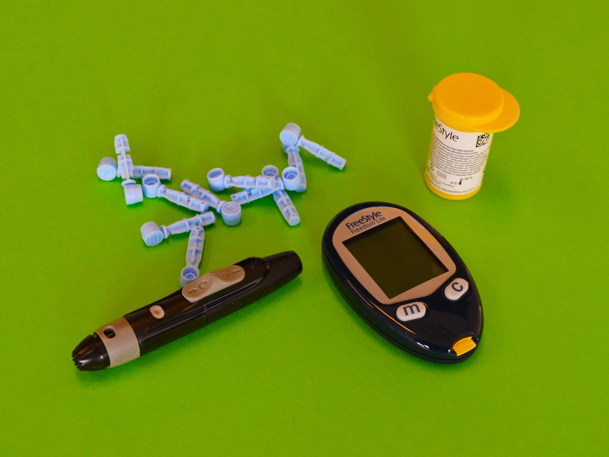

# Diabetes Prediction

A data science projecto to predict diabetes

## Dataset Information

    

 

This dataset is at Kaggle [Pima Indians Diabetes Database]() dataset. It is originally from the National Institute of Diabetes and Digestive and Kidney Diseases. The objective of the dataset is to diagnostically predict whether or not a patient has diabetes, based on certain diagnostic measurements included in the dataset. Several constraints were placed on the selection of these instances from a larger database. In particular, all patients here are females at least 21 years old of Pima Indian heritage.

### Attributes

1. Pregnancies | Number of times pregnant

1. Glucose | Plasma glucose concentration a 2 hours in an oral glucose tolerance test

1. BloodPressure | Diastolic blood pressure (mm Hg)

1. SkinThickness | Triceps skin fold thickness (mm)

1. Insulin | 2-Hour serum insulin (mu U/ml)

1. | Body mass index (weight in kg/(height in m^2)

1. DiabetesPedigreeFunction | Diabetes pedigree function

1. Age | Age (years)

1. Outcome | Class variable (0 or 1) 268 of 768 are 1, the others are 0

## Context

## Methodology

This project will be based on Cross-industry standard process for data mining (CRISP-DM). A standard idea about data science project may be linear: data preparation, modeling, evaluation and deployment. However, when we use CRISP-DM methodology a data science project become circle-like form. Even when it ends in Deployment, the project can restart again by Business Understanding. How might it help?

    

It may help to avoid the data scietist to stop in one specific step and wast time on it. When all the project is completed the data scientist can return to initial step and do every step again. Therefore, the main goal it is to follow circles as it needs.

<!--
### Pipeline

* Opening

* Data Descriptions

* Feature Engineering

* Data Exploration

* Filtering Variables

* Exploratory Data Analysis

* Data Preparation

* Feature Selection

* Machine Learning Modeling

* Hyperparameter Fine Tuning

* Traduction and Error's Interpretation

* Deploy
-->

## References

* [Pima Indians Diabetes Database](https://www.kaggle.com/uciml/pima-indians-diabetes-database)

## License

This project is licensed under the MIT License - see the [LICENSE](LICENSE) file for details.